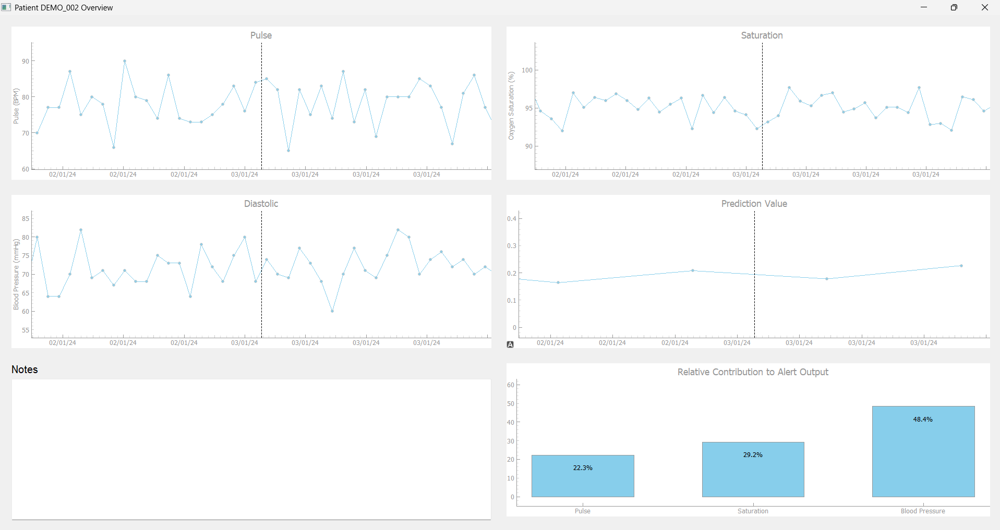

# GUI for Clinical Interpretation of COPD Telemetry and Alert Outputs

This project is a PyQt5-based graphical user interface developed to support clinical interpretation of COPD patient telemetry data and precomputed alert outputs from an external prediction system.

The interface visualises selected patient measurements over time and displays prediction values alongside a relative contribution view for selected measurement types.



## Project context

This project was developed as part of the MSc course *Clinical Information Systems and Models* in Biomedical Engineering & Informatics.

The aim was to explore how clinical telemetry data and prediction outputs could be presented in a graphical interface to support interpretation of patient trajectories.

## Features

- Patient selection interface
- Visualization of telemetry measurements over time
- Display of precomputed prediction values
- Relative contribution view for selected measurement types
- Demo version using synthetic data

## Data and privacy

The original project used clinical telemetry data and precomputed prediction outputs that cannot be shared publicly.

This public portfolio version uses synthetic demo data with the same general structure as the original data. Original patient data and original model parameters are not included.

## Technologies used

- Python
- PyQt5
- pyqtgraph
- pandas
- NumPy

## How to run

Install dependencies:

```bash
pip install -r requirements.txt
```

Run the application:

```bash
python main.py
```

The demo data can be regenerated with:

```bash
python data/generate_sample_data.py
```

## Repository structure

```text
copd-telemetry-gui/
├── data/
│   ├── generate_sample_data.py
│   ├── load_data.py
│   ├── sample_measurements.csv
│   └── sample_predictions.csv
├── docs/
│   └── screenshots/
├── gui/
├── logic/
├── main.py
├── requirements.txt
└── README.md
```

## Notes

This repository is intended as a portfolio version of the original university project. It demonstrates the graphical interface, data loading structure, and visualization workflow using synthetic data.
